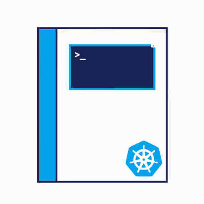

    

# kuberdiction
> An AI assistant which can suggest Kubernetes commands.

## Deployment
This tool is currently live:

[Link](ec2-13-52-163-4.us-west-1.compute.amazonaws.com)

** This tool is still experimental. Please verify any commands for accuracy before using.

## Training
The dataset used for training this model was created by ComponentSoft.
- https://huggingface.co/datasets/ComponentSoft/k8s-kubectl-cot-20k

The base for this model utilizes an encoder-decoder model developed by Google named T5 (Text-to-Text Transfer Transformer).
- https://huggingface.co/docs/transformers/en/model_doc/t5

> Work in progress ⚠️